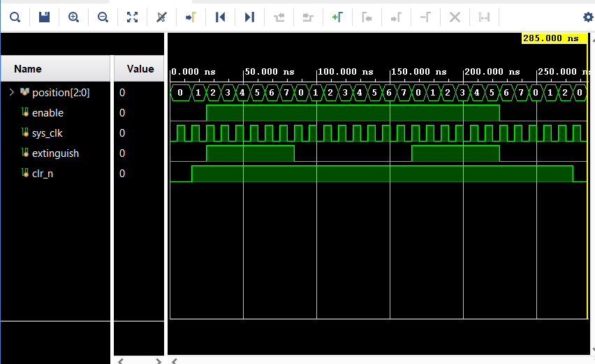
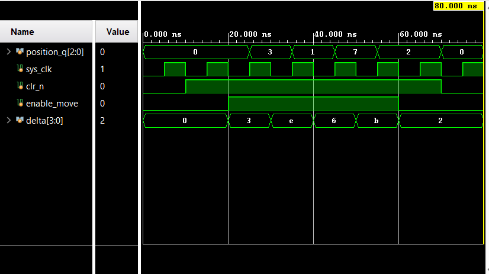
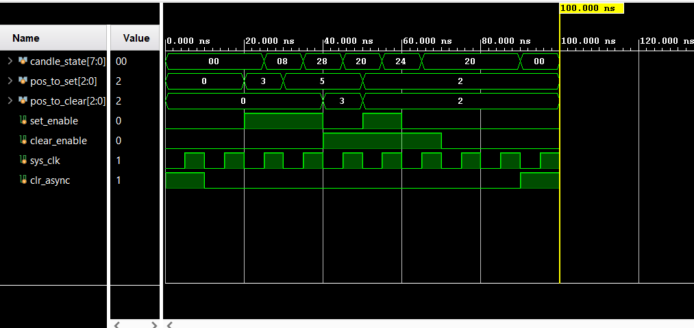
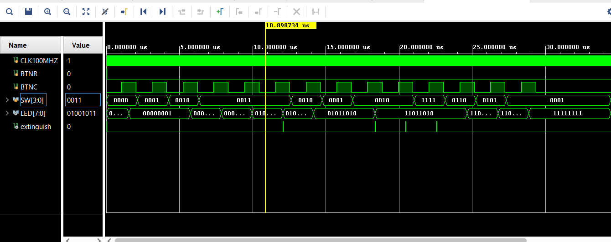
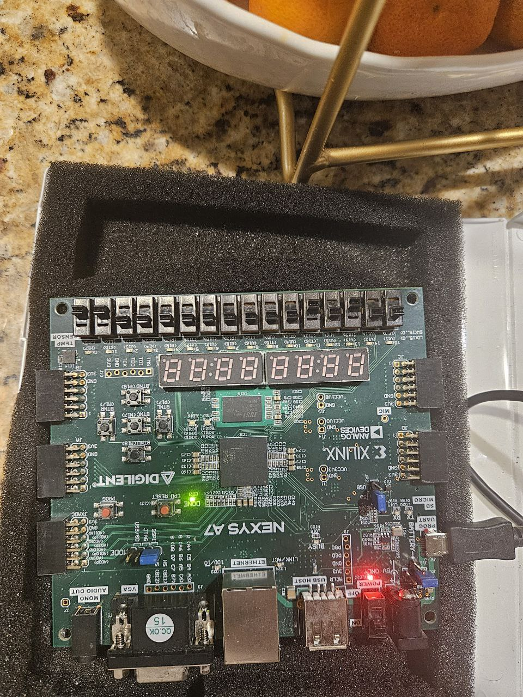
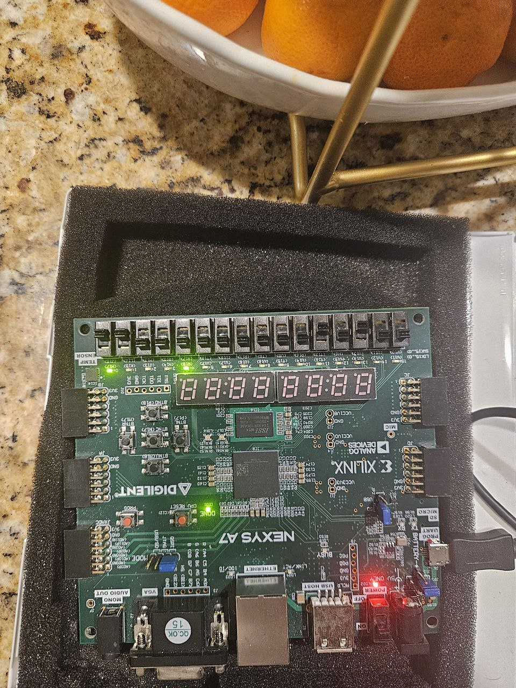
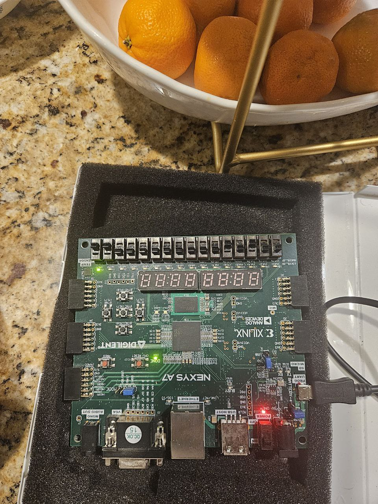
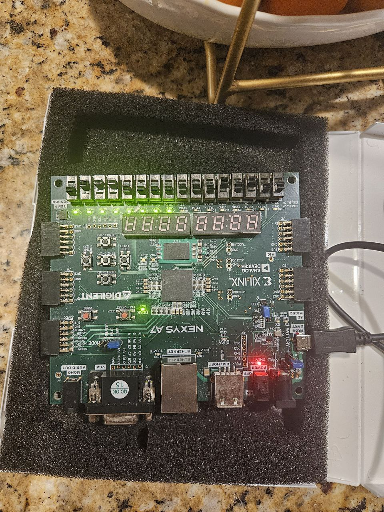

# HW 4 (Muhammad Umar)

## Module 1: extinguisher

My source code:

```verilog
`timescale 1ns / 1ps

module extinguisher(
    input logic [2:0] position,  
    input logic enable,
    input logic sys_clk,
    output logic extinguish, 
    input logic clr_n
);

    logic [3:0] counter;  

    always_ff @(posedge sys_clk or negedge clr_n) begin
        if (!clr_n)
            counter <= 0; // Reset Counter
        else
            counter <= counter + 1; 
    end

    always_ff @(posedge sys_clk) begin
        if (enable && (counter[2:0] == position)) // BTNC Enabled
            extinguish <= 1;  // Extinguish enable
        else
            extinguish <= 0; // Default Case
    end

endmodule
```

My test bench:

```verilog
`timescale 1ns / 1ps

module extinguisher_tb;

    logic [2:0] position;
    logic enable;
    logic sys_clk;
    logic extinguish;
    logic clr_n;

    extinguisher dut (
        .position(position),
        .enable(enable),
        .sys_clk(sys_clk),
        .extinguish(extinguish),
        .clr_n(clr_n)
    );

    always #5 sys_clk = ~sys_clk;  

    initial begin
        sys_clk = 0;
        clr_n = 0;
        enable = 0;
        #15;

        clr_n = 1;
        #10;

        enable = 1;
        repeat (20) begin
            #10;
        end

        enable = 0;
        #50;
        clr_n = 0;
        #10;

        $finish;
    end

endmodule
```

Results:
    



## Module 2: igniter 

My source code:

```verilog
`timescale 1ns / 1ps

module igniter(
    output logic [2:0] position_q,  
    input logic sys_clk,             
    input logic clr_n,              
    input logic enable_move,         
    input logic [3:0] delta          
);

    logic [2:0] position_d;         

    always_comb begin
        if (enable_move)
            position_d = (position_q + delta[2:0]) % 8;  // Use only 3 LSBs of delta
        else
            position_d = position_q; 
    end

    always_ff @(posedge sys_clk or negedge clr_n) begin
        if (!clr_n) begin
            position_q <= 3'b000; // Position_q is zero
        end else begin
            position_q <= position_d; 
        end
    end

endmodule
```

My test bench:

```verilog
`timescale 1ns / 1ps
module tb;

    logic [2:0] position_q;
    logic sys_clk;
    logic clr_n;
    logic enable_move;
    logic [3:0] delta;
    
    igniter dut (
        .position_q(position_q),
        .sys_clk(sys_clk),
        .clr_n(clr_n),
        .enable_move(enable_move),
        .delta(delta)
    );

    always #5 sys_clk = ~sys_clk; // (100 MHz)

    initial begin
        sys_clk = 0;
        clr_n = 0;           
        enable_move = 0;
        delta = 4'b0000;

        #10 clr_n = 1;       
        #10 enable_move = 1; delta = 3; // 3
        #10 enable_move = 1; delta = -2; // -2 
        #10 enable_move = 1; delta = 6; // 6
        #10 enable_move = 1; delta = -5; // -5
        #10 enable_move = 0; delta = 2; // Hold position
        #10 clr_n = 0;
        #10 $finish;         
    end
endmodule
```

Results:
    



## Module 3: candle_controller 

My source code:

```verilog
`timescale 1ns / 1ps

module candle_controller(
    output logic [7:0] candle_state,  
    input logic [2:0] pos_to_set,      
    input logic [2:0] pos_to_clear,    
    input logic set_enable,            
    input logic clear_enable,          
    input logic sys_clk,               
    input logic clr_async              
);

    always_ff @(posedge sys_clk or posedge clr_async) begin 
        if (clr_async) 
            candle_state <= 8'b00000000;
        else begin
            if (set_enable) 
                candle_state[pos_to_set] <= 1;    // Set the specified candle bit
            if (clear_enable)
                candle_state[pos_to_clear] <= 0;  // Clear the specified candle bit
        end
    end

endmodule
```

My test bench:

```verilog
`timescale 1ns / 1ps

module candle_controller_tb;

    logic [7:0] candle_state;  
    logic [2:0] pos_to_set;    
    logic [2:0] pos_to_clear;  
    logic set_enable;          
    logic clear_enable;        
    logic sys_clk;             
    logic clr_async;           

    candle_controller dut (
        .candle_state(candle_state),
        .pos_to_set(pos_to_set),
        .pos_to_clear(pos_to_clear),
        .set_enable(set_enable),
        .clear_enable(clear_enable),
        .sys_clk(sys_clk),
        .clr_async(clr_async)
    );

    always #5 sys_clk = ~sys_clk;

    initial begin

        sys_clk = 0;
        clr_async = 1;  
        set_enable = 0;
        clear_enable = 0;
        pos_to_set = 3'b000;
        pos_to_clear = 3'b000;

        #10 clr_async = 0;  
        #10;

        // Set position 3
        set_enable = 1;
        pos_to_set = 3;
        #10 set_enable = 0;

        // Set position 5
        set_enable = 1;
        pos_to_set = 5;
        #10 set_enable = 0;

        // Clear position 3
        clear_enable = 1;
        pos_to_clear = 3;
        #10 clear_enable = 0;

        // Set and clear position 2 at the same time
        set_enable = 1;
        clear_enable = 1;
        pos_to_set = 2;
        pos_to_clear = 2;
        #10 set_enable = 0; clear_enable = 0;

        // Clear position 2
        clear_enable = 1;
        pos_to_clear = 2;
        #10 clear_enable = 0;
        
        #20 
        clr_async = 1;  
        #10
        $finish;
    end

endmodule
```
Results:



## Module 4: Top

My source code:

```verilog
`timescale 1ns / 1ps 

module top (
    input wire CLK100MHZ, 
    input wire BTNR,           
    input wire BTNC,           
    input wire [3:0] SW,       
    output wire [7:0] LED,
    output wire extinguish     
);

    logic btn_pulse;
    logic [7:0] candle_state;
    logic [2:0] match_position;

    // Debounce and one-shot for button press
    debounce_and_oneshot debounce_inst (
        .out(btn_pulse),    // Filtered pulse output
        .btn(BTNC),         // Raw button input
        .clk_50MHz(CLK100MHZ), 
        .rst(BTNR)
    );

    // Igniter module
    igniter igniter_inst (
        .position_q(match_position),
        .sys_clk(CLK100MHZ),
        .clr_n(~BTNR),
        .enable_move(btn_pulse), 
        .delta(SW)
    );

    // Candle control
    candle_controller candle_ctrl_inst (
        .candle_state(candle_state),
        .pos_to_set(match_position),
        .pos_to_clear(3'b000),
        .set_enable(btn_pulse), 
        .clear_enable(extinguish), 
        .sys_clk(CLK100MHZ),
        .clr_async(BTNR)
    );

    // Extinguisher module
    extinguisher extinguisher_inst (
        .position(match_position), 
        .enable(btn_pulse), 
        .sys_clk(CLK100MHZ),
        .extinguish(extinguish),
        .clr_n(~BTNR)
    );
    assign LED = candle_state;

endmodule
```


My test bench:

```verilog
`timescale 1ns / 1ps

module top_game_tb;

    reg CLK100MHZ;
    reg BTNR;
    reg BTNC;
    reg [3:0] SW;
    wire [7:0] LED;
    wire extinguish;
    top_game dut (
        .CLK100MHZ(CLK100MHZ),
        .BTNR(BTNR),
        .BTNC(BTNC),
        .SW(SW),
        .LED(LED),
        .extinguish(extinguish)
    );

    // Clock generation (100 MHz)
    always #5 CLK100MHZ = ~CLK100MHZ;

    initial begin
        CLK100MHZ = 0;
        BTNR = 0;
        BTNC = 0;
        SW = 4'b0000;

        $display("Applying reset...");
        #20 BTNR = 1;
        #20 BTNR = 0;
        $display("Reset released.");

        // Move match by 0
        $display("Move match by 0...");
        SW = 4'b0000;
        #1000 BTNC = 1;
        #1000 BTNC = 0;
        #100;
        $display("LED output after move by 0: %b", LED);

        // Move match by 1
        $display("Move match by 1...");
        SW = 4'b0001;
        #1000 BTNC = 1;
        #1000 BTNC = 0;
        #100;
        $display("LED output after move by 1: %b", LED);

        // Move match by 2
        $display("Move match by 2...");
        SW = 4'b0010;
        #1000 BTNC = 1;
        #1000 BTNC = 0;
        #100;
        $display("LED output after move by 2: %b", LED);

        // Move match by 3
        $display("Move match by 3...");
        SW = 4'b0011;
        #1000 BTNC = 1;
        #1000 BTNC = 0;
        #100;
        $display("LED output after move by 3: %b", LED);
        
        // Move match by 3
        $display("Move match by 3...");
        SW = 4'b0011;
        #1000 BTNC = 1;
        #1000 BTNC = 0;
        #100;
        $display("LED output after move by 3: %b", LED);
        
        // Move match by 3
        $display("Move match by 3...");
        SW = 4'b0011;
        #1000 BTNC = 1;
        #1000 BTNC = 0;
        #100;
        $display("LED output after move by 3: %b", LED);
        
        // Move match by 2
        $display("Move match by 2...");
        SW = 4'b0010;
        #1000 BTNC = 1;
        #1000 BTNC = 0;
        #100;
        $display("LED output after move by 2: %b", LED);        

       // Move match by 1
        $display("Move match by 1...");
        SW = 4'b0001;
        #1000 BTNC = 1;
        #1000 BTNC = 0;
        #100;
        $display("LED output after move by 1: %b", LED);
        
        // Move match by 2
        $display("Move match by 2...");
        SW = 4'b0010;
        #1000 BTNC = 1;
        #1000 BTNC = 0;
        #100;
        $display("LED output after move by 2: %b", LED);  
        
        // Move match by 2
        $display("Move match by 2...");
        SW = 4'b0010;
        #1000 BTNC = 1;
        #1000 BTNC = 0;
        #100;
        $display("LED output after move by 2: %b", LED); 
        
        // Move match by 2
        $display("Move match by -1...");
        SW = 4'b1111;
        #1000 BTNC = 1;
        #1000 BTNC = 0;
        #100;
        $display("LED output after move by -1: %b", LED); 
                // Move match by 2
        $display("Move match by 6...");
        SW = 4'b0110;
        #1000 BTNC = 1;
        #1000 BTNC = 0;
        #100;
        $display("LED output after move by 6: %b", LED); 
        
        $display("Move match by 5...");
        SW = 4'b0101;
        #1000 BTNC = 1;
        #1000 BTNC = 0;
        #100;
        $display("LED output after move by 5: %b", LED); 
        
        $display("Move match by 1...");
        SW = 4'b0001;
        #1000 BTNC = 1;
        #1000 BTNC = 0;
        #100;
        $display("LED output after move by 1: %b", LED); 
        
        #5000;
        $stop;
    end

endmodule
```
Results:



Using this testbench, my program successfully achieved the ultimate goal of obtaining all 1s. The "extinguish" function works, but the SW (delta) may not be updating the position accurately in "ignition" function. Despite this, the program still reaches the desired outcome.

## Generating Bitstream

For simulation purposes, I had connected the 'extinguish' signal to the output port. However, to generate the bitstream, we need to disconnect the 'extinguish' signal from the output port and move it to the workspace.

My source code:

```verilog
`timescale 1ns / 1ps 

module top (
    input wire CLK100MHZ, 
    input wire BTNR,           
    input wire BTNC,           
    input wire [3:0] SW,       
    output wire [7:0] LED      
);

    logic btn_pulse;
    logic [7:0] candle_state;
    logic [2:0] match_position;
    logic extinguish;

    // Debounce and one-shot for button press
    debounce_and_oneshot debounce_inst (
        .out(btn_pulse),    // Filtered pulse output
        .btn(BTNC),         // Raw button input
        .clk_50MHz(CLK100MHZ), 
        .rst(BTNR)
    );

    // Igniter module
    igniter igniter_inst (
        .position_q(match_position),
        .sys_clk(CLK100MHZ),
        .clr_n(~BTNR),
        .enable_move(btn_pulse), 
        .delta(SW)
    );

    // Candle control
    candle_controller candle_ctrl_inst (
        .candle_state(candle_state),
        .pos_to_set(match_position),
        .pos_to_clear(3'b000),
        .set_enable(btn_pulse), 
        .clear_enable(extinguish), 
        .sys_clk(CLK100MHZ),
        .clr_async(BTNR)
    );

    // Extinguisher module
    extinguisher extinguisher_inst (
        .position(match_position), 
        .enable(btn_pulse), 
        .sys_clk(CLK100MHZ),
        .extinguish(extinguish),
        .clr_n(~BTNR)
    );
    assign LED = candle_state;

endmodule
```
To generate the bitstream, you need to run the `proj.tcl` file by calling the `source proj.tcl` command. It's important to ensure that the `proj.tcl` file is located outside the `src` directory. The `src` contains the source (rtl) and constraint (constraints) files. If it is not outside the `src` directory, it might cause problems.

## FPGA Board Pictures

No LED On:



Two LEDs On (After moves):



One LED On (Extinguish occurs):



All LEDs On (Game Completed):



## Appendix
Note that on many linux systems a document converter, pandoc, can be used to render this file as an html file, which can with further effort be converted to other formats including PDF.

```bash
pandoc HW4B.md -o HW4B.html --standalone
```
